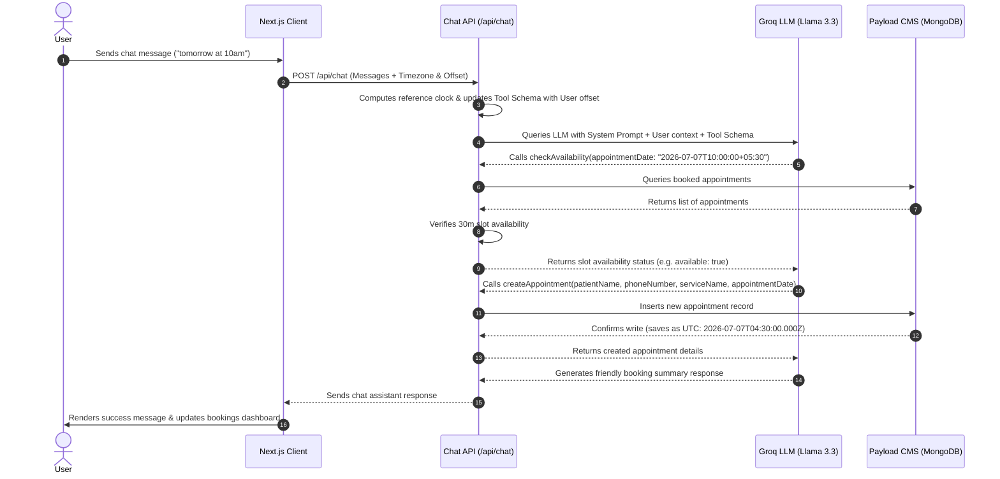

# 🦷 Lumina Dental Studio — Smart Appointment Assistant

A premium, containerized dental assistant web application featuring an interactive, timezone-aware AI receptionist designed to book appointments naturally in real time. Powered by **Next.js (App Router)**, **Payload CMS (v3)**, **MongoDB**, and the **Groq API** with advanced function-calling.

---

## 🌟 Key Features

1. **AI Receptionist (Groq)**: Uses a custom system prompt and LLM function calling to conduct natural conversation and collect booking details (Name, Phone Number, Selected Service, and Date/Time).
2. **Timezone Synchronizer**: Automatically captures user timezone, offset, and local time on the client, synchronizing them with the backend AI reference clock. Local inputs like `"10am today"` are converted to the correct UTC timestamp in MongoDB.
3. **Double-Booking Prevention**: Checks slot conflicts using a 30-minute window before confirming bookings. Informs users of booking overlaps formatted to their local timezone.
4. **Dynamic CMS Integration**: Fetches services directly from the Payload CMS backend database, with a beautiful client fallback UI loaded automatically if the database is uninitialized.
5. **Docker Orchestrated**: Boots up the frontend web server, Payload CMS administration panel, and MongoDB database using a single command.

---

## 📐 System Architecture

The workflow below illustrates the coordination between the client, Next.js server, Groq LLM, and MongoDB:



---

## 🛠️ Project Structure

```text
├── backend/            # Payload CMS v3 Backend Server
│   ├── src/
│   │   ├── collections/# Database schemas (Services, Appointments, Users)
│   │   └── payload.config.ts
│   ├── Dockerfile
│   └── .env.example
├── frontend/           # Next.js 15+ Frontend Web App
│   ├── app/
│   │   ├── api/        # Proxy API routes (chat, services, appointments)
│   │   └── page.tsx    # Live booking dashboard
│   ├── components/     # Chat interface components
│   ├── lib/            # Groq & Payload CMS integration clients
│   └── Dockerfile
├── docker-compose.yml  # Multi-container orchestration config
└── README.md           # Documentation
```

---

## ⚙️ Quick Start Setup

### 1. Prerequisites
Ensure you have the following installed:
* [Docker Desktop](https://www.docker.com/products/docker-desktop/)
* [Docker Compose](https://docs.docker.com/compose/install/)
* A **Groq API Key** (Create one at [console.groq.com](https://console.groq.com/))

### 2. Configure Environment Files

Create the configuration environment files in each workspace folder:

#### **Backend Config (`./backend/.env`)**
Create `./backend/.env` (you can copy `./backend/.env.example` as a template):
```env
PAYLOAD_SECRET=your-super-secret-key-change-me
DATABASE_URI=mongodb://mongodb:27017/appointment-cms
```
*(Note: Inside the Docker network, the database URI points directly to the `mongodb` service host).*

#### **Frontend Config (`./frontend/.env.local`)**
Create `./frontend/.env.local`:
```env
GROQ_API_KEY=your_groq_api_key_here
GROQ_MODEL=llama-3.3-70b-versatile
PAYLOAD_API=http://backend:3000/api
```
*(Note: Replace `your_groq_api_key_here` with your actual Groq API key).*

### 3. Spin up the Containers

Run the following command at the root directory of the project:
```bash
docker-compose up --build
```

This starts three services:
1. **MongoDB Database** (Exposed on `localhost:27017`)
2. **Payload CMS Backend Panel** (Exposed on `http://localhost:3000`)
3. **Next.js Web Client** (Exposed on `http://localhost:3002`)

---

## 📖 Step-by-Step Testing Guide

Follow these steps to initialize services and test the AI capabilities:

### Step 1: Create an Admin Account
1. Open your browser and navigate to the CMS Panel: `http://localhost:3000/admin`.
2. Follow the prompt to create your first admin user.

### Step 2: Add Dental Services
1. Once logged into the admin dashboard, go to the **Services** collection.
2. Click **Create New** to add your clinic services. For example:
   * **Name**: `Teeth Whitening`, **Description**: `Professional laser whitening session`, **Price**: `299`
   * **Name**: `Dental Consultation`, **Description**: `General oral checkup and x-rays`, **Price**: `49`
3. Click **Save** for each service.

### Step 3: Test the AI Receptionist
1. Open the booking website: `http://localhost:3002`.
2. Notice that the custom services you added in Step 2 display on the left sidebar in real time!
3. Interact with the chat interface. For example, type:
   > *"Hello, my name is John Doe and my phone is 555-0199. I want to book a Teeth Whitening appointment tomorrow at 10am."*
4. The AI will:
   * Detect the correct appointment service.
   * Evaluate slot availability relative to your timezone.
   * Insert the booking record.
5. Check your Payload CMS database (or the bookings dashboard) to verify that the appointment was recorded at **10:00 AM local time** (stored correctly in UTC depending on your local timezone offset).

### Step 4: Test Double-Booking Prevention
1. In the chat, type:
   > *"I want to book an appointment for Jane Smith, phone 555-0245 for Teeth Whitening tomorrow at 10:15am."*
2. The AI calls `checkAvailability` for tomorrow at 10:15 AM, detects that it falls within the 30-minute block of John Doe's 10:00 AM slot, and politely reports that the slot is taken, formatting the conflict time using your local timezone.

---


